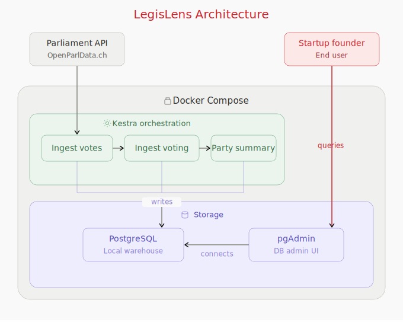

# DENG

## Instructions to start pipeline

First clone this repository to be able to start the pipeline locally:
Navigate to the directory where you want to clone the repo and run the following command:  
`git clone https://github.com/hannah22700/DENG.git`

Navigate inside the repo:  
`cd DENG`

Inside you should find the docker-compose.yml file which contains all the containers needed for the pipeline.

Start it with:  
`docker-compose up -d`

Wait until the containers finished starting.

After that you can check the Kestra User Interface to see the pipeline.
Access Kestra on https://localhost:8080

Since this is purely a school project username and pasword will be provied in this README.

Username: admin@kestra.io  
Password: Admin1234!

### Kestra

After logging into Kestra, you should see the `openparl_ingest` flow in the `deng` namespace. The flow file is automatically loaded on startup.

To run the pipleline: 
1. Click on the flow `openparl_ingest`
2. Click "Execute"
3. Select the number of votes you want to process. The default is 100 votes.
4. Click "Execute" again to start

The pipeline runs three main tasks sequentially:
1. **ingest_votes**: This tasks fetches all votes from the Swiss Parliament API and loads them into PostgreSQL. 
2. **ingest_voting**: This task festches all the individual voting records (from votes) and loads them into PostgreSQL.
3. **aggregate_party_summary**: The third task aggregates voting records into a per-party summary for each vote

Currently the flow is scheduled to run automatically every Monday morning at 6 AM. It supports backfills via the Kestra UI. You can see this when you have the flow `openparl_ingest` selected, under the Triggers tab.

## Documentation

### Dependencies

The following python dependencies are in use:
| Package | Version | Explanation |
|-------------------|----------|-------------|
| click | 8.3.1 | used to add parameters to the main script through the command line |
| jupyter | 1.1.1 | used for jupyter notebooks to play around and test certain things |
| pandas | 3.0.1 | used for the organization of data into dataframes and some statistical methods |
| sqlalchemy | 2.0.48 | used for the engine to connect to the posgres DB|
| swissparlpy | 1.0.0 | used as abstraction of the SwissParl API |

### Extraction

The data extraction is done with the `dataconnector.py`

For the extraction of the data the python library swissparlpy is used.
The Library provides an abstraction to the api which makes it much easier to use.
See the github page of the library for more information: [SwissParlpy](https://github.com/metaodi/swissparlpy)

The dataconnector contains three methods:

| Method                        | Explanation                                                                                                                                                                                                 |
| ----------------------------- | ----------------------------------------------------------------------------------------------------------------------------------------------------------------------------------------------------------- |
| get_votes()                   | Is used to get all the occasions where there was a vote for a bill. Votes are only collected in German since the other languages offer only redundant data                                                  |
| get_voting(votes)             | gets the voting for each vote. A vote contains the person that voted, what they voted and with which party they are affiliated with.                                                                        |
| save_voting_of_vote(id, path) | helper method that gets the voting records of a single vote and saves it to the filesystem in the current directory to the foled voting. This is done to avoid a timeout when collecting the voting records |
| def delete_pickels(path)      | helper method to delete the saved pickles on the filesystem                                                                                                                                                 |

### Transformation

The data transformation is done with the `datatransform.py`

| Method                      | Explanation                                                                                                                                                                                   |
| --------------------------- | --------------------------------------------------------------------------------------------------------------------------------------------------------------------------------------------- |
| clean_up_votes(votes)       | drops the unwanted column Language from the votes dataframe                                                                                                                                   |
| clean_up_voting(voting)     | drops the unwanted column Language and PargroupColor from the dataframe. It also reorganizes the indexes, since they are no longe correct after merging the votings together from the pickles |
| create_pary_summary(voting) | aggregates information about how every party voted on each bill, including summing up the total seats and calculating the mode for each voting Decision                                       |
| clean_column(name)          | helper method to remove spaces and special characters from dataframe column names                                                                                                             |

### Load

The loading of the data into the Postgres DB is done with the `main.py`
| Method | Explanation |
| ------ | ----------- |
|ingest_data(engine, data, target_table, chunksize) | converts a dataframe to sql and adds it to the DB |
| main(pg_user, pg_pass, pg_host, pg_port, pg_db, chunksize) | ties everything together, the loading the transforming and the ingestion of the data.|

### Pipeline Orchestration

The pipeline is orchestrated with [Kestra](https://kestra.io/). The flow definition can be found in `flows/openparl_ingest.yml`. It is loaded automatically into Kestra on startup via the `--flow-path` flag. 

Some key design decisions:
- **Custom Docker image** (`openparl-kestra:latest`): All necessary Python dependencies are pre-installed to avoid re-installing them individually for every task.
- **pluginDefaults**: We share a base configuration for Docker task runner, container image, script files across all different tasks. This config is defined once under `pluginDefaults` and inherited by all tasks
- **Variables**: The database connection string and a predefined chunk size (100000) are defined as flow-level variables
- **Scheduling**: A weekly cron trigger runs the pipeline every Monday morning at 6 AM
- **Backfills**: The pipeline follows a full-refresh strategy: every run fetches the complete dataset and replaces the existing tables, making it idempotent. A single execution always produces a fully up-to-date database, regardless of missed runs. Backfills can be triggered manually through the Kestra UI under the Triggers tab.
