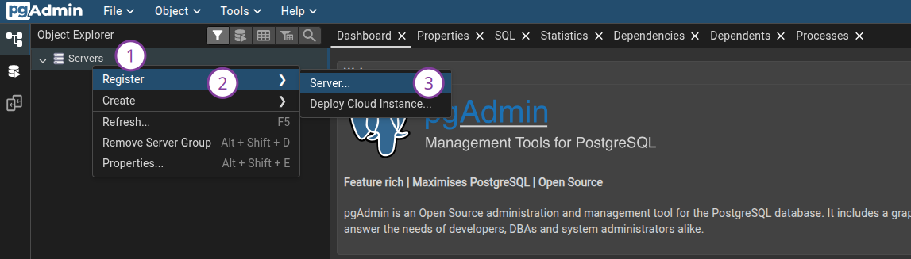
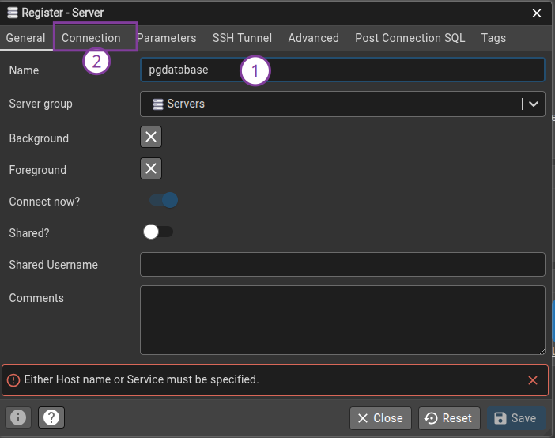
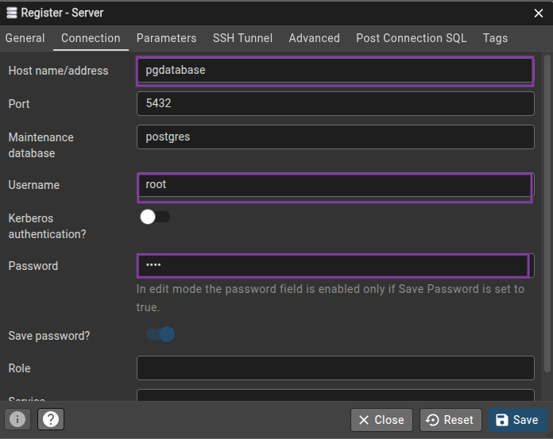
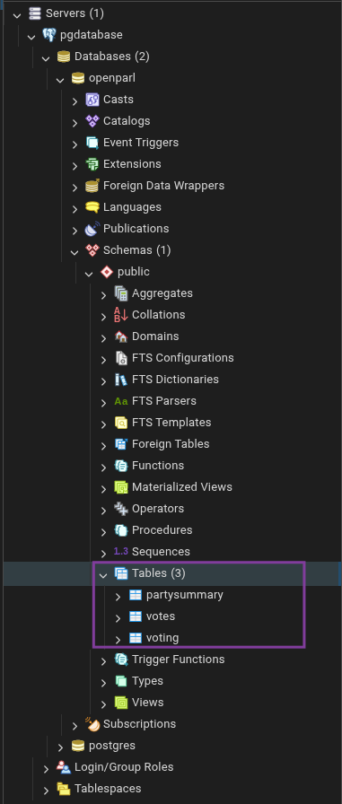
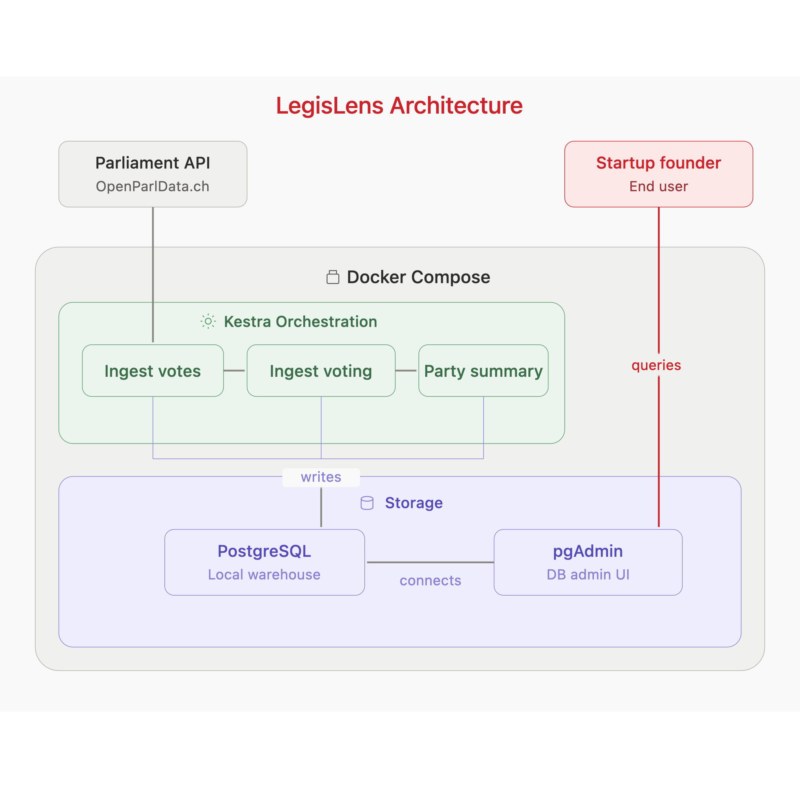
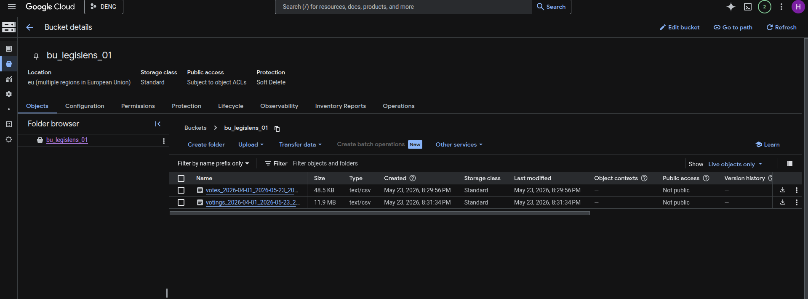
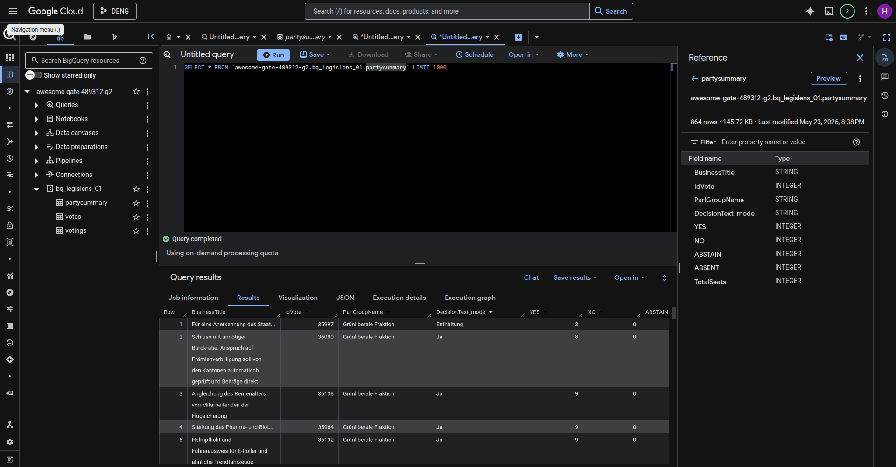

# DENG

## Project Structure

The directory structure and important files are liste here:

```
.
├── flows                             # Contains Kestra Flows
│   |── openparl_ingest_bigquery.yml  # Kestra Flow
|   |── openparl_ingest_datalake.yml  # Kestra Flow
|   └── openparl_ingest_local.yml     # Kestra Flow
├── media                             # Contains Images for documentation
├── scripts                           # Contains Scripts for the kestra flows
│   ├── clouddataingest.py            # Data Ingestion for the cloud
│   ├── dataconnector.py              # Data Extraction from openparl
│   ├── datatransform.py              # Data Transformation
|   └── localdataingest.py            # Data Ingestion for the local postgres db
├── sql                               # Contains sample SQL Scripts
|── terraform                         # Contains IaC for Google Cloud Resources
|   ├── schemas                       # Contains Schmeas for big query tables
|   |   ├── partysummary.json         # Schema of the partysummary table
|   |   ├── votes.json                # Schema of the votes table
|   |   └── votings.json              # Schema of the votings table
|   ├── main.tf                       # Terraform file to create storage bucket and big query
|   └── variables.tf                  # Contains the variables for main.tf
├── docker-compose.yml                # Docker Compose file
├── Dockerfile_cloud.kestra           # Docker file for Kestra that installs dependencies for the cloud pipelines
├── Dockerfile_local.kestra           # Docker file for Kestra that installs dependencies for the local pipelines
├── ingest_bq_stage.py                # Script to stage data in the big query
|── ingest_datalake.py                # Script to collect data from openparl and write it to a datalake
|── ingest_local.py                   # Script to collect data from openparl and write it to the local postgres db
├── persona.md                        # description of our persona
├── pyproject.toml                    # virtual environment configuration
├── README.md                         # README
└── uv.lock                           # virtaul environment configuration
```

## Instructions to start local pipeline

### Prerequisites

For the pipeline to be run locally the following componentes have to be installed:

- Docker
- Docker Compose
- uv

### Instructions

First clone this repository to be able to start the pipeline locally:
Navigate to the directory where you want to clone the repo and run the following command:  
`git clone https://github.com/hannah22700/DENG.git`

Navigate inside the repo:  
`cd DENG`

Ensure that you have a working .env file. For reference .env_example can be found in the repo. For an easy set up, copy it and rename it to .env.

The following .env variables are relevant for the local set up:

```
KESTRA_USERNAME
KESTRA_PASSWORD
KESTRA_POSTGRES_USERNAME
KESTRA_POSTGRES_PASSWORD
ENV_POSTGRES_USERNAME
ENV_POSTGRES_PASSWORD
PGADMIN_DEFAULT_EMAIL
PGADMIN_DEFAULT_PASSWORD
```

After that start the neccessary containers with docker compose:

Start it with:  
`docker compose up -d`

Wait until the containers finished starting.

To start the pipeline locally without orchestration the `main.py` can be used.

Make sure you have uv installed, for the command to work.

Start the local pipeline with:

```
uv run main.py --voteCount=10
```

The parameter voteCount is used to control the number of votes that votings will be collected from. If the number is two large the pipeline will take very long.

### Verify pipeline result

To verify the result of the pipeline the postgres database is accessible with pgadmin:
https://localhost:8085

Username: admin@admin.com
Password: root

In pgadmin the database can be connected like this:





In the connection tab the following credentials have to be entered:

Username: root  
Password: root



Now the three tables that were created by the pipeline should there:  


The data can now be freely explored.

### Kestra

Access Kestra on https://localhost:8080

Login with the Username and the password you set in .env as KESTRA_USERNAME and KESTRA_PASSWORD

After logging into Kestra, you should see the `openparl_ingest_local` flow in the `deng` namespace. The flow file is automatically loaded on startup.

To run the pipleline:

1. Click on the flow `openparl_ingest_local`
2. Click "Execute"
3. Select the number of votes you want to process. The default is 100 votes.
4. Click "Execute" again to start

The pipeline runs three main tasks sequentially:

1. **ingest_votes**: This tasks fetches all votes from the Swiss Parliament API and loads them into PostgreSQL.
2. **ingest_voting**: This task festches all the individual voting records (from votes) and loads them into PostgreSQL.
3. **aggregate_party_summary**: The third task aggregates voting records into a per-party summary for each vote

Currently the flow is scheduled to run automatically every Monday morning at 6 AM. It supports backfills via the Kestra UI. You can see this when you have the flow `openparl_ingest_local` selected, under the Triggers tab.



## Instructions to start cloud pipeline

### Prerequisites

#### Google Cloud

Ensure that you have a working service account on the google cloud. The account needs permissions to create big query resources and storage buckets.
Save the credentials for the service account on you file system in a json file.
How this is done was covered in the course and will not be described here further.

#### Clone Repo

First clone this repository to be able to start the pipeline:
Navigate to the directory where you want to clone the repo and run the following command:  
`git clone https://github.com/hannah22700/DENG.git`

Navigate inside the repo:  
`cd DENG`

#### Env File and variables.tf

Ensure that you have a working .env file. For reference .env_example can be found in the repo. For an easy set up, copy it and rename it to .env.

The following .env variables are relevant for the cloud set up:

```
ENV_GOOGLE_CREDENTIALS
ENV_PROJECT_NAME
ENV_BUCKET_NAME
ENV_BIGQUERY_NAME
KESTRA_USERNAME
KESTRA_PASSWORD
KESTRA_POSTGRES_USERNAME
KESTRA_POSTGRES_PASSWORD
```

_Please specify the correct project name in the env file. This will be different for your set up_

If you change an env variable that is also used in variables.tf you have to change it there also.

Use the following table for reference which values need to be changed together.

| variable.tf       | .env                   |
| ----------------- | ---------------------- |
| `credentials`     | ENV_GOOGLE_CREDENTIALS |
| `project`         | ENV_PROJECT_NAME       |
| `bq_dataset_name` | ENV_BIGQUERY_NAME      |
| `gcs_bucket_name` | ENV_BUCKET_NAME        |

_Please make sure to configure the correct path for the credentials file and the correct project name!_

### Terraform

To be able to run the pipeline the google cloud resources have to be created with Terraform.

For this run the following commands (start out in the directory where you cloned this repo):

```bash
cd terraform
```

```bash
terraform plan
```

Review which resources terrafrom will create. It should create

- one storage bucket
- one big query dataset
- 3 google big query tables: votes, votings and partysummary

If everything looks correct run:

```bash
terraform apply
```

After again reviewing the changes terraform would like to make, enter yes into the prompt.

Check in google cloud if the ressources were created.
The big query tables should all be empty, but have a defined schema.

### Containers

Start the containers up with:
`docker compose up -d`

### Kestra

Access Kestra on https://localhost:8080

Login with the Username and the password you set in .env as KESTRA_USERNAME and KESTRA_PASSWORD

#### openparl_ingest_datalake

This Kestra flow ingests voting data from the Swiss Parliament API, processes it into CSV format, and uploads the results to Google Cloud Storage (GCS).

##### Tasks

| Task            | Description                                              |
| --------------- | -------------------------------------------------------- |
| `ingest_votes`  | Fetches vote metadata and uploads it to GCS.             |
| `votes_exist`   | Checks whether vote data exists before continuing.       |
| `ingest_voting` | Fetches detailed voting records and uploads them to GCS. |

##### Special Notes

- Runs in Docker using a custom Python image
- Uses `.pkl` files for task-to-task data sharing
- Supports manual date inputs (`since`, `until`)
- Scheduled to run weekly every Monday at 06:00
- Uses environment variables for GCP and credential configuration

##### Execution

1. Click on the flow `openparl_ingest_datalake`
2. Click "Execute"
3. Select the start and the end range of the votes that you want to process.
   - The time period has to include a range where the Notionalrat is in session, otherwise you cannot extract any votes. To check when the Nationalrat is in session you can use this website: https://www.parlament.ch/de/ratsbetrieb/sessionen
4. Click "Execute" again to start

#### openparl_ingest_bigquery

This Kestra flow downloads voting data files from Google Cloud Storage (GCS), stages them in BigQuery, transforms the data into analytics-ready tables, and creates aggregated party voting summaries.

##### Tasks

| Task                  | Description                                                               |
| --------------------- | ------------------------------------------------------------------------- |
| `stage_data`          | Downloads CSV files from GCS and loads them into BigQuery staging tables. |
| `transform_votes`     | Merges staged vote metadata into the `votes` table.                       |
| `transform_votings`   | Merges staged voting records into the `votings` table.                    |
| `drop_staging`        | Removes temporary staging tables after ingestion.                         |
| `create_partysummary` | Creates aggregated party-level voting summaries in BigQuery.              |

##### Special Notes

- Uses Docker-based Python execution with a custom image
- Uses BigQuery `MERGE` statements for incremental loading
- Automatically creates aggregated analytics tables
- Scheduled to run weekly every Monday at 08:00
- Uses environment variables for GCP, BigQuery, and credential configuration

##### Execution

1. Click on the flow `openparl_ingest_bigquery`
2. Click "Execute"
3. Select the date from which you want to ingest the data. This date references the cloud storage bucket files. So if you are running this on the same day as openparl_ingest_datalake you have to choose the date of that day.
4. Click "Execute" again to start

### Review Data

For the review of the data open the google cloud console: https://console.cloud.google.com/

#### Cloud Storage

Open Cloud Storage -> Buckets

You should now see the storage bucket you created. Click on its name to browse the files.

There you should two files, one with votes the other with votings from your selected time range and with todays date as timestamp



#### Big Query

Open BigQuery -> Studio

You should see the big query dataset you created when you expand your project.

Three tables should be visible:

- votes
- votings
- partysummary

You can now check if the pipeline ingested data by using the following select statements:

```sql
SELECT * FROM `[ProjectName].[BigQueryName].votes` LIMIT 1000
```

```sql
SELECT * FROM `[ProjectName].[BigQueryName].votings` LIMIT 1000
```

```sql
SELECT * FROM `[ProjectName].[BigQueryName].partysummary` LIMIT 1000
```

If all of these statements return data the pipeline has succeded.

Example:


### Clean Up

After you are done with testing the pipeline, don't forget to destroy the terraform resources again with:

```bash
terraform destroy
```

Review the changes terraform would like to make and then answer the prompt with yes.

## Documentation

### Dependencies

The following python dependencies are in use:
| Package | Version | Explanation |
| --------------------- | ------- | ---------------------------------------------------------------------------------------------- |
| click | 8.3.1 | used to add parameters to the main script through the command line |
| jupyter | 1.1.1 | used for Jupyter notebooks to play around and test certain things |
| pandas | 3.0.1 | used for the organization of data into dataframes and some statistical methods |
| sqlalchemy | 2.0.48 | used for the engine to connect to the PostgreSQL DB |
| psycopg2-binary | 2.9.11 | used to connect to the PostgreSQL DB |
| swissparlpy | 1.0.0 | used as abstraction of the SwissParl API |
| dotenv | 0.9.9 | used to load environment variables from a `.env` file for configuration and secrets management |
| google-cloud-bigquery | 3.41.0 | used to interact with Google BigQuery for querying and storing analytical data |
| google-cloud-storage | 3.10.1 | used to interact with Google Cloud Storage for uploading and downloading files |
| pandas-gbq | 0.35.0 | used to integrate pandas dataframes with Google BigQuery |
| pyarrow | 24.0.0 | used for efficient in-memory columnar data processing and parquet file support |

### Environment Variables

| Variable                   | Example Value              | Explanation                                                              |
| -------------------------- | -------------------------- | ------------------------------------------------------------------------ |
| `ENV_GOOGLE_CREDENTIALS`   | `/secrets/google-key.json` | path to the Google Cloud service account credentials JSON file           |
| `ENV_PROJECT_NAME`         | `awesome-gate-489312-g2`   | Google Cloud project name used for BigQuery and Cloud Storage operations |
| `ENV_BUCKET_NAME`          | `bu_legislens_01`          | Google Cloud Storage bucket used to store files and datasets             |
| `ENV_BIGQUERY_NAME`        | `bq_legislens_01`          | BigQuery dataset name where tables are created and loaded                |
| `KESTRA_USERNAME`          | `admin@kestra.io`          | username/email used to log into the Kestra orchestration UI              |
| `KESTRA_PASSWORD`          | `Admin1234!`               | password used for the Kestra UI authentication                           |
| `KESTRA_POSTGRES_USERNAME` | `kestra`                   | PostgreSQL username used internally by Kestra                            |
| `KESTRA_POSTGRES_PASSWORD` | `k3str4`                   | PostgreSQL password used internally by Kestra                            |
| `ENV_POSTGRES_USERNAME`    | `root`                     | PostgreSQL username for the application database connection              |
| `ENV_POSTGRES_PASSWORD`    | `root`                     | PostgreSQL password for the application database connection              |
| `PGADMIN_DEFAULT_EMAIL`    | `admin@admin.com`          | default login email for the pgAdmin interface                            |
| `PGADMIN_DEFAULT_PASSWORD` | `root`                     | default password for the pgAdmin interface                               |

> **Note:** The credentials and passwords shown above are example values and should be replaced with secure secrets in production environments.

> **Important:** The `ENV_` prefixes are necessary for Kestra to correctly recognize and inject the environment variables.

### Terraform

Terraform is used to make the environment reproducible

#### Terraform Variables

Terraform also uses variables which at times have the same value as the environment variables:

| Variable            | Default Value              | Explanation                                                                                    |
| ------------------- | -------------------------- | ---------------------------------------------------------------------------------------------- |
| `credentials`       | `/secrets/google-key.json` | path to the Google Cloud service account credentials file used by Terraform for authentication |
| `project`           | `awesome-gate-489312-g2`   | Google Cloud project ID where resources will be created                                        |
| `region`            | `us-central1`              | default Google Cloud region used for regional resources and services                           |
| `location`          | `EU`                       | location used for multi-region resources such as BigQuery datasets                             |
| `bq_dataset_name`   | `bq_legislens_01`          | name of the BigQuery dataset created and managed by Terraform                                  |
| `gcs_bucket_name`   | `bu_legislens_01`          | name of the Google Cloud Storage bucket created by Terraform                                   |
| `gcs_storage_class` | `STANDARD`                 | storage class assigned to the Google Cloud Storage bucket                                      |

> **Note:** These variables are used by Terraform to parameterize the infrastructure configuration and make deployments reusable across environments.

#### Resources

| Resource                             | Explanation                                                                                               |
| ------------------------------------ | --------------------------------------------------------------------------------------------------------- |
| `google_storage_bucket.bucket`       | creates a Google Cloud Storage bucket used for storing project files and datasets                         |
| `google_bigquery_dataset.dataset`    | creates a BigQuery dataset used for analytical data storage                                               |
| `google_bigquery_table.votes`        | creates the `votes` table in BigQuery using the schema definition from `schemas/votes.json`               |
| `google_bigquery_table.votings`      | creates the `votings` table in BigQuery using the schema definition from `schemas/votings.json`           |
| `google_bigquery_table.partysummary` | creates the `partysummary` table in BigQuery using the schema definition from `schemas/partysummary.json` |

#### Additional Notes

- The Google provider is configured using service account credentials.
- The storage bucket is configured with `force_destroy = true` to allow deletion even when files exist.
- BigQuery tables use external JSON schema definitions for easier schema management.
- `deletion_protection = false` allows tables to be removed during Terraform destroy operations.

### Scripts

#### Extraction

The data extraction is done with the `dataconnector.py` for bot the local pipeline and the cloud pipeline.

For the extraction of the data the python library swissparlpy is used.
The Library provides an abstraction to the api which makes it much easier to use.
See the github page of the library for more information: [SwissParlpy](https://github.com/metaodi/swissparlpy)

The dataconnector contains three methods:

| Method                        | Explanation                                                                                                                                                                                                 |
| ----------------------------- | ----------------------------------------------------------------------------------------------------------------------------------------------------------------------------------------------------------- |
| get_votes()                   | Is used to get all the occasions where there was a vote for a bill. Votes are only collected in German since the other languages offer only redundant data                                                  |
| get_voting(votes)             | gets the voting for each vote. A vote contains the person that voted, what they voted and with which party they are affiliated with.                                                                        |
| save_voting_of_vote(id, path) | helper method that gets the voting records of a single vote and saves it to the filesystem in the current directory to the foled voting. This is done to avoid a timeout when collecting the voting records |
| def delete_pickels(path)      | helper method to delete the saved pickles on the filesystem                                                                                                                                                 |

#### Transformation

The data transformation is done with the `datatransform.py` in case of the local pipeline.

| Method                      | Explanation                                                                                                                                                                                   |
| --------------------------- | --------------------------------------------------------------------------------------------------------------------------------------------------------------------------------------------- |
| clean_up_votes(votes)       | drops the unwanted column Language from the votes dataframe                                                                                                                                   |
| clean_up_voting(voting)     | drops the unwanted column Language and PargroupColor from the dataframe. It also reorganizes the indexes, since they are no longe correct after merging the votings together from the pickles |
| create_pary_summary(voting) | aggregates information about how every party voted on each bill, including summing up the total seats and calculating the mode for each voting Decision                                       |
| clean_column(name)          | helper method to remove spaces and special characters from dataframe column names                                                                                                             |

#### Load

The loading of the data into the Postgres DB is done with the `localdataingest.py` for the local pipeline
| Method | Explanation |
| ------ | ----------- |
|ingest_data(engine, data, target_table, chunksize) | converts a dataframe to sql and adds it to the DB |

For the cloud pipeline loading is done with `clouddataingest.py`

| Method                                                  | Explanation                                                                                                   |
| ------------------------------------------------------- | ------------------------------------------------------------------------------------------------------------- |
| `gcs_connector(credentials, bucketname)`                | initializes a connector for Google Cloud Storage using service account credentials and a target bucket        |
| `verify_gcs_upload(blob_name)`                          | verifies whether a file exists in the configured Google Cloud Storage bucket                                  |
| `upload_to_gcs(file_path, chunk_size, max_retries=3)`   | uploads a file to Google Cloud Storage with configurable chunk size and retry handling                        |
| `get_from_gcs(path)`                                    | downloads and returns the content of a file stored in Google Cloud Storage                                    |
| `get_blobs()`                                           | retrieves all blobs/files available in the configured Google Cloud Storage bucket                             |
| `gbq_connector(credentials, bigqueryname, projectname)` | initializes a connector for Google BigQuery using service account credentials, dataset name, and project name |
| `load_data(df, table)`                                  | loads a pandas dataframe into a BigQuery table and overwrites existing table data                             |

### Pipeline Orchestration

The pipeline is orchestrated with [Kestra](https://kestra.io/). The definition of the different flows can be found in `flows/`. It is loaded automatically into Kestra on startup via the `--flow-path` flag.

There are three flows:

- openparl_ingest_local -> used for the local pipeline
- openparl_ingest_datalake -> used for the cloud pipeline
- openparl_ingest_bigquery -> used for the cloud pipeline

#### Local

This Kestra flow fetches voting data from the Swiss Parliament API (`swissparlpy`), processes it with pandas, and ingests it into a PostgreSQL database.

##### Flow Tasks

| Task                      | Explanation                                                                                                            |
| ------------------------- | ---------------------------------------------------------------------------------------------------------------------- |
| `ingest_votes`            | fetches vote metadata from the Swiss Parliament API, cleans the data, and stores it in the PostgreSQL `votes` table    |
| `ingest_voting`           | retrieves individual voting records for each vote, transforms the data, and stores it in the PostgreSQL `voting` table |
| `aggregate_party_summary` | aggregates voting results into party-level summaries and stores them in the `partysummary` table                       |

###### Inputs

| Input       | Explanation                                                                                         |
| ----------- | --------------------------------------------------------------------------------------------------- |
| `num_votes` | defines how many votes should be fetched and processed (`10`, `50`, `100`, `250`, `1000`, or `all`) |

##### Variables

| Variable    | Explanation                                         |
| ----------- | --------------------------------------------------- |
| `db_url`    | PostgreSQL connection string used across all tasks  |
| `chunksize` | number of rows inserted into the database per batch |

##### Additional Notes

- Tasks run inside Docker containers using a shared custom image (`openparl-python-local:latest`).
- Intermediate pandas dataframes are shared between tasks using pickle files.
- The workflow is automatically triggered every Monday at 6 AM using a cron schedule.

#### Cloud

##### Datalake

This Kestra flow fetches voting data from the Swiss Parliament API (`swissparlpy`) and uploads the processed datasets as CSV files to Google Cloud Storage.

###### Flow Tasks

| Task            | Explanation                                                                                                       |
| --------------- | ----------------------------------------------------------------------------------------------------------------- |
| `ingest_votes`  | fetches vote metadata for a given date range, converts it into CSV format, and uploads it to Google Cloud Storage |
| `votes_exist`   | checks whether vote data was successfully generated before continuing the workflow                                |
| `ingest_voting` | retrieves individual voting records for the fetched votes and uploads them as CSV files to Google Cloud Storage   |

###### Inputs

| Input   | Explanation                         |
| ------- | ----------------------------------- |
| `since` | start date for fetching voting data |
| `until` | end date for fetching voting data   |

###### Variables

| Variable    | Explanation                                             |
| ----------- | ------------------------------------------------------- |
| `chunksize` | upload chunk size used for Google Cloud Storage uploads |
| `filepath`  | local temporary directory used for generated CSV files  |

###### Additional Notes

- Tasks run inside Docker containers using the custom image `openparl-python-cloud:latest`.
- Google Cloud credentials and bucket configuration are injected through environment variables.
- Data is stored in Google Cloud Storage as timestamped CSV files.
- The workflow runs automatically every Monday at 6 AM and ingests the previous 7 days of voting data.

##### Big Query

This Kestra flow loads data from Google Cloud Storage into BigQuery staging tables, transforms it into final tables, and generates aggregated party summaries.

###### Flow Tasks

| Task                  | Explanation                                                                                                 |
| --------------------- | ----------------------------------------------------------------------------------------------------------- |
| `stage_data`          | downloads CSV files from Google Cloud Storage, filters by date, and loads them into BigQuery staging tables |
| `transform_votes`     | merges staged vote data into the final `votes` table in BigQuery                                            |
| `transform_votings`   | merges staged voting data into the final `votings` table in BigQuery                                        |
| `drop_staging`        | removes staging tables after processing to keep the dataset clean                                           |
| `create_partysummary` | aggregates voting results by party and vote, and writes the final `partysummary` table                      |

###### Input

| Input  | Explanation                                                                  |
| ------ | ---------------------------------------------------------------------------- |
| `date` | date used to filter which files from Google Cloud Storage should be ingested |

###### Data Flow

- CSV files are retrieved from Google Cloud Storage
- Data is loaded into BigQuery staging tables (`stg_votes`, `stg_votings`)
- Staging tables are merged into final tables using `MERGE` operations
- Staging tables are dropped after successful processing
- A final aggregation creates a party-level summary table

###### Additional Notes

- Uses BigQuery `MERGE` statements for incremental updates (no duplicate inserts).
- Designed for idempotent execution (safe to rerun for the same date).
- Runs weekly via a scheduled trigger (Monday at 08:00).
- Uses Docker-based Python execution environment with shared GCP utilities.

```

```
